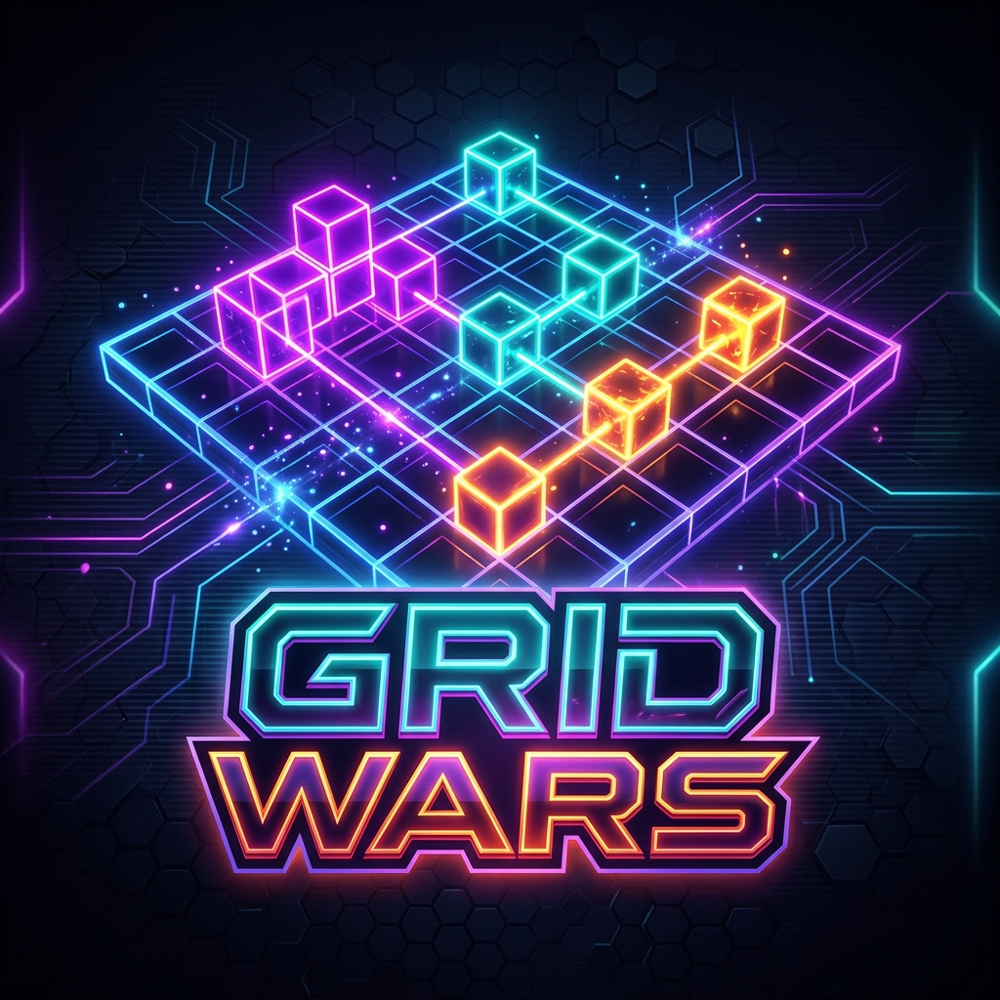

# 🟩 Grid Wars



Grid Wars is a real-time, multiplayer territory capture game. Everyone plays on the same 20x20 grid, and the goal is simple: capture as many blocks as you can to climb the leaderboard.

It's built to be fast, responsive, and persistent.

## 🕹️ How to Play

1. **Connect:** When you open the app, you'll be assigned a random name (like `CosmicFox42`) and a unique color.
2. **Capture:** Click or hover over blocks to claim them.
3. **Fight:** You can steal blocks from other players, but there's a **3-second lock** once a block is captured to prevent endless clicking wars on a single tile.
4. **Win:** Watch your score grow on the live leaderboard and see real-time activity in the feed.

## 🚀 Technical Highlights

I built this as a monorepo to keep the frontend and backend logic close together.

*   **Real-time Sync:** Uses Socket.io for sub-50ms updates across all clients.
*   **State Persistence:** The grid state is saved to a local JSON file on the server. If the server restarts, the "wars" continue exactly where they left off.
*   **Smooth UI:** Framer Motion handles the block transitions, so the grid feels alive rather than static.
*   **Mobile Ready:** The layout is fully responsive, so you can capture territory on your phone.

## 🛠️ Tech Stack

*   **Frontend:** React, Vite, Tailwind CSS, Framer Motion, Lucide Icons.
*   **Backend:** Node.js, Express, Socket.io.
*   **State:** Local filesystem persistence (`grid_state.json`).

## ⚙️ Setup & Installation

The project is structured with a root `package.json` that handles dependencies for both the client and server.

### 1. Install everything
From the root directory:
```bash
npm install
```
*(This will automatically run `npm install` in both `/client` and `/server` folders)*

### 2. Run in Development
You'll need two terminals:

**Terminal 1 (Server):**
```bash
cd server
npm run dev
```

**Terminal 2 (Client):**
```bash
cd client
npm run dev
```

### 3. Production Build
To build the frontend and start the production server:
```bash
npm run build
npm start
```
The server will serve the compiled React app from `client/dist`.

## 🧠 Dev Notes

*   **Grid Size:** Currently set to 20x20 (400 blocks) in `server/server.js`.
*   **Cooldowns:** There's a 20ms click cooldown on the server to prevent script-botting.
*   **Ghost Territory:** When a user disconnects, their blocks stay on the grid until someone else captures them.

---
